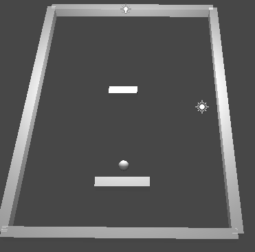
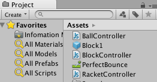
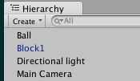
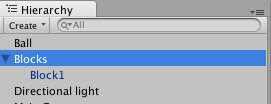
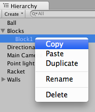
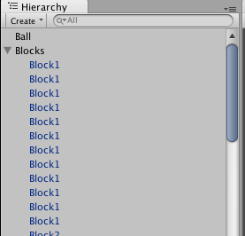
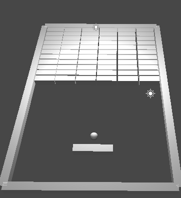
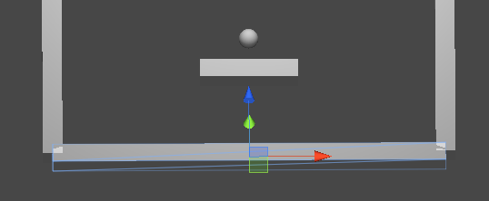
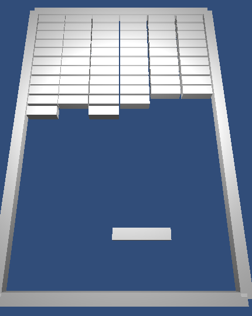

#第二回ルールを追加


前回の内容で基本的な挙動が完成したので、次はゲームのルール追加などを行なっていきます。


##破壊可能なブロックの追加


破壊可能なブロックを作成して行きましょう。


まずは破壊可能なるブロックを１つ作成します。ラケットと同様に、適当な位置に細長い立方体を配置しましょう。こちらも壁やボールと高さを合わせるため、TransformのPosision Y座標を0にすることを忘れないように注意します。また立方体の名前はBlock1としておいて下さい。


今度はプロジェクトパネル上で[Create][Javascript]を選択します。新しいスクリプトがプロジェクトに追加されますので、名前を「BlockContoller」とします。


次に「BlockContoller」スクリプトを編集します。以下のコードを記述して下さい。

```
function OnCollisionEnter(collision: Collision) {
     Destroy(gameObject);
}
```


このOnCollisionEnterは、Rigidbodyで動作しているオブジェクト（例えばボール等）が接触したときに呼ばれる処理です。引数（collision）には接触対象のオブジェクトZ含まれます。
そして2行目のDestroyメソッドでGameObject、つまりコンポーネントを実行したオブジェクトつまり接触したブロックを削除しています。


最後に「BlockContoller」スクリプトを「Block1」オブジェクトに追加します。
これでBlock1に「ボールと接触した際に削除される」機能が追加されました。


さっそく実行してみましょう。上手くブロックは削除できましたか？




##ブロックの配置


作成したブロックを早速量産してみましょう。
ただし、単純に追加するとブロックが大量にヒエラルキービューに配置され、管理が難しくなります。そのため、まずは空のゲームオブジェクトを作成し、その中で配置していきましょう。
ただし、ブロックを量産すると一度に変更する事が面倒になります。そのためまずはブロックの雛形を作成しましょう。

方法は簡単、先ほど作成した「Block1」をProjectビューにドラッグ＆ドロップして下さい。HierarchyビューのBlock１の文字が青くなり、ProjectビューにBlock1と同名のオブジェクトが作成されます。
この雛形についての説明は後ほどしますので、今は画面を作って行きましょう。

   




ただし、このままではHierarchyビューがゴチャゴチャしてしまうので、少し整理します。

まずは[GameObject]->[Create Empty]で空のゲームオブジェクトを追加し、名前をBlocksに変更します。この時、Blockの座標は（x:0, y:0, z:0）にしておくと良いでしょう。
次にHierarchyにある Block1 をBlocksにドラッグ＆ドロップします。するとBlocksの下にBlock1が入った事が確認できます。

この状態を親子関係と言います。この場合はBlocksが親、Block1が子に当たります。
この時、親の座標やスケール情報を子は受け継ぐので、一括でオブジェクトを動かしたりする際に有効です。





後はBlockをコピー＆ペーストしてBlockを画面上に敷き詰めてみましょう。

Blockのコピーは、Hierarchyの[Block1]を右クリックし[Copy]、その後右クリックの[Paste]を選択します。
勿論、Command(Ctrl)＋Cキーでコピー、Command(Ctrl)＋Vでペーストも行えます。



オブジェクトの座標はTransformのPositionのX軸とZ軸を変更します。Y軸は壁と同じく0に設定します。
さっそくBlock1を配置していきましょう。







##ボールが破棄されるルールの追加


ブロック崩しではラケットより下のブロックに接触するとボールが破棄されるルールが一般的です。
今回はそれに習い、下のバーに接触時した時に球が消滅する処理を追加します。


まずプロジェクトパネル上で[Create][Javascript]と選択します。新しいスクリプトがプロジェクトに追加されますので、名前をBottomWallControllerとします。


次に生成されたスクリプトに以下の記述を追加します。

```
function OnCollisionEnter(collision: Collision) {
     Destroy(collision.gameObject);
}
```


こちらもBlockContollerと同じくOnCollisionEnterを使用します。
２行目で削除している対象がcollision.gameObject、つまり接触しているオブジェクトを削除しています。


最後に作成した「BottomWallController」スクリプトをラケットの下の壁にドラッグアンドドロップしましょう。これでボールがラケット下の壁にボールが接触した時、ボールが破棄されるルールが追加されました。







---

さて、今回は基本的なゲームのルールを追加しました。
こうなると「ボールが一定時間でスピードアップ」や「2回・3回叩かないと壊れないブロック」等を作りたくなりますね。
それは宿題としましょう。

次回は音や演出等、ゲームを華やかにする要素を説明します。
