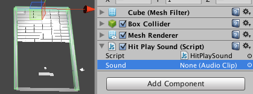
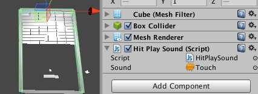
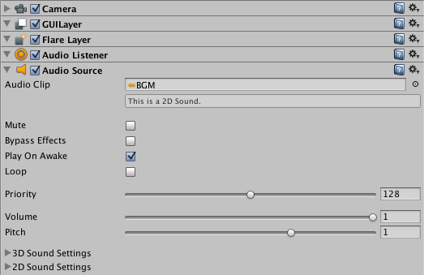
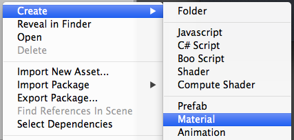
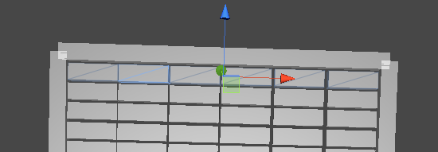
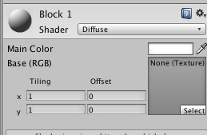
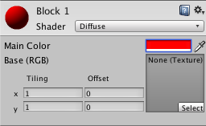
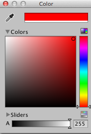
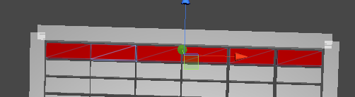
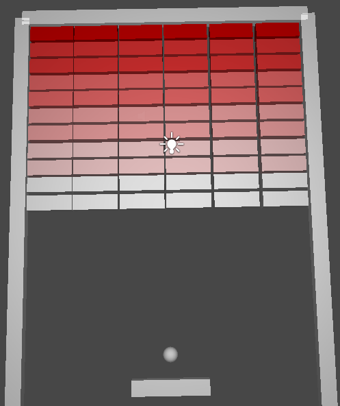

#第三回


前回はゲームのルールを追加し、基本的なゲームの体裁を整えました。
しかし、単純に消えるだけでは華やかさが足りないので、今回はゲームの演出を追加していきます。


##音の追加


今回使用する音をインポートします。
まず[こちらのリンク](https://github.com/unity3d-jp/First-Unity-Example/raw/gh-pages/Chapter%203/sound.unitypackage)からサウンドファイル、sound.unitypackageファイルを取得します。

ダウンロードしたファイルをダブルクリックしてください。するとインポートが始まり、プロジェクトビューにSoundフォルダ及び以下のファイルが追加されました。

-  BGM
-  Damage
-  Death
-  Spawn
-  Touch

これでUnityからサウンドを使用出来る形になりました。さっそく音を追加していきましょう。


###接触時の音に再生するスクリプト


次に、「物が当たった時に音を再生する機能」を作成していきます。
これは前回で「物が命中した際に呼び出す」機能を応用して実装します。


まず、新しいスクリプト「HitPlaySound」を追加します。

次に、下記のコードを追加します。

```
public var sound : AudioClip;


function OnCollisionEnter(collision: Collision) {
     AudioSource.PlayClipAtPoint(sound, transform.position);
}
```


少し解説しましょう。まず1行目のAudioClipは音を登録する変数です。AudioClipに音を登録し、4行目のAudioSource.PlayClipAtPointにて音を再生しています。なお、音の発生源は第二引数で指定します。今回の場合は、音の発生源に接触した対象の位置を使用します。

では、このスクリプトを「外壁」に登録します。ただし、一つ一つ登録するのは面倒くさいので一括で登録しましょう。

まずShiftを押しながら外壁を選択し、次にインスペクターにHitPlaySoundコンポーネントをドラッグ＆ドロップします。最後に、プロジェクトビューにある先ほどインポートした音の中から「Touch」をドラッグ＆ドロップし
インスペクターにあるHItPlaySoundのsoundに登録します。




早速実行してみて下さい。
壁にボールが当たった際に音が再生されましたか？


上手くいったならば、同様に壊れるブロックとラケットにも音を追加していきましょう。

まずヒエラルキービューのBlockを[Shit]を押しながら一気に選択します。
次にHitPlaySoundをインスペクタビューにドラッグ＆ドロップして登録します。最後にサウンド「Damage」をインスペクターのSoundにドラッグ＆ドロップで登録します。

同様に、RacketにHitPlaySoundを登録します。再生するサウンドはTouchを登録しておきましょう。
ついでに一番下の壁（BottomWall）にHitPlaySoundを登録し、サウンド「Death」を登録します。

実際にプレイしてみましょう。
サウンドが気に入りませんか？　色々と登録して試してみて下さい。

最後にBGMを追加しましょう。
ヒエラルキーのMain Cameraを選択し、プロジェクトビューのサウンド「BGM」をインスペクターにドラッグ&ドロップします。




早速プレイしましょう。
音楽が変わるだけでグっとゲームらしくなりますね。

##色をつけてカラフルに


最後は色を付けましょう。


まずProjectビューを右クリックで開き[Create][Material]を選択します。
マテリアルの名前は「BlockMaterial 1」としておきましょう。




次に、上のほうの消せるブロックを選択し、先ほど作成した「BlockMaterial 1」をインスペクタにドラッグ＆ドロップで登録します。




その後プロジェクトビューの「BlockMaterial 1」マテリアルを選択し、Main Colorを赤く変更します。





赤く変更するにはMain Colorの右側の白い部分を選択し、表示されたカラーパレットの赤い部分を選択します。



画面上部のブロックが赤くなりましたか？





では同様の手順でブロックに色を付けて行きましょう。

「BlockMaterial 2」〜「BlockMaterial 6」を作成し、それぞれの段のブロックに登録。
後はマテリアルの色を階段上になるように調整していきます。




次回はいよいよAndroidに書き出します。
